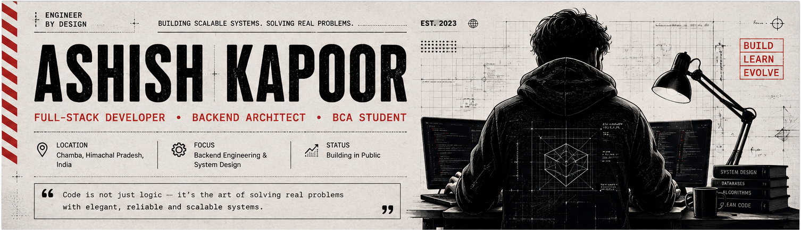
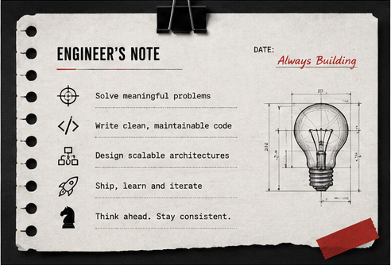
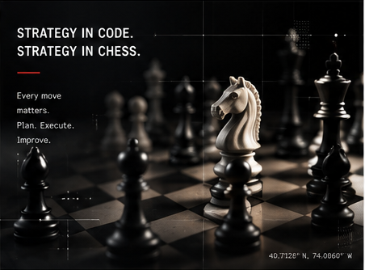
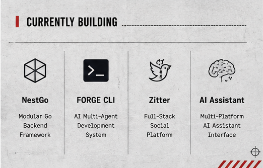

<!--
  ASHISH KAPOOR — ENGINEER EDITORIAL GITHUB PROFILE
  Suggested repository: Ashishkapoor1469/Ashishkapoor1469
  Put generated images inside the /assets folder.
-->

<div align="center">



<br/>

<a href="https://github.com/Ashishkapoor1469">
  
</a>
&nbsp;

&nbsp;


<br/><br/>

<code>CODE.</code>
&nbsp;•&nbsp;
<code>DESIGN.</code>
&nbsp;•&nbsp;
<code>BUILD.</code>
&nbsp;•&nbsp;
<code>REPEAT.</code>

</div>

---

## ENGINEER'S NOTEBOOK

<table>
<tr>
<td width="58%" valign="top">

### Ashish Kapoor

I am a **Full-Stack Developer** and **BCA student** from **Chamba, Himachal Pradesh**.

I enjoy building useful products, scalable backend systems, developer tools, and AI-powered applications. My work combines practical engineering, clean architecture, thoughtful user experience, and continuous learning.

```ts
const ashish = {
  role: "Full-Stack Developer",
  location: "Chamba, Himachal Pradesh",
  focus: [
    "Backend Engineering",
    "System Design",
    "Developer Tooling",
    "AI Applications"
  ],
  mindset: "Think. Plan. Execute. Improve."
};
```

</td>
<td width="42%" valign="top">



</td>
</tr>
</table>

---

## ENGINEER'S TOOLKIT

<div align="center">

### Frontend


### Backend


### Databases & Infrastructure


### Tools


</div>

---

## THINK. PLAN. EXECUTE.

<table>
<tr>
<td width="38%" align="center" valign="middle">



</td>
<td width="62%" valign="top">

### Engineering and chess share the same principles

- Understand the complete position before acting.
- Break complex problems into smaller moves.
- Think about trade-offs and future consequences.
- Build a strong foundation before attacking.
- Improve the system after every mistake.

> **Chess taught me patience. Code taught me precision. The mountains taught me perspective.**

</td>
</tr>
</table>

---

## FEATURED WORK

<table>
<tr>
<td width="50%" valign="top">

### 01 — NestGo

**Modular Go Backend Framework**

An opinionated backend framework for Go inspired by structured enterprise architecture while preserving performance and type safety.

`Go` `Chi` `PostgreSQL` `JWT` `CLI`

- Modular application structure
- Dependency injection
- Resource generation
- Database migrations
- Route and architecture diagnostics

<a href="https://github.com/Ashishkapoor1469/Nestgo">
  
</a>

</td>
<td width="50%" valign="top">

### 02 — FORGE

**AI Multi-Agent CLI System**

A terminal-based development system that coordinates planner, manager, and worker agents to turn ideas into structured implementation.

`TypeScript` `Node.js` `Ollama` `OpenRouter` `CLI`

- Multi-agent planning
- Parallel execution waves
- Local and cloud models
- Persistent project memory
- Real source-file generation

<a href="https://github.com/Ashishkapoor1469/FORGECLI">
  
</a>

</td>
</tr>

<tr>
<td width="50%" valign="top">

### 03 — Zitter

**Full-Stack Social Platform**

A scalable social-content application with authentication, media uploads, engagement features, feeds, and production-ready backend components.

`Next.js` `React` `Express` `MongoDB` `Redis` `Docker`

- JWT authentication
- Email verification
- Infinite feed
- Cloudinary uploads
- Redis rate limiting
- Responsive interface

<a href="https://github.com/Ashishkapoor1469/Fullstackapplication">
  
</a>
&nbsp;
<a href="https://minitwitter-psi.vercel.app">
  
</a>

</td>
<td width="50%" valign="top">

### 04 — Multi-Platform AI Assistant

**Unified AI Experience**

A provider-independent assistant architecture designed for web, desktop, and command-line environments.

`Next.js` `TypeScript` `REST APIs` `AI Providers`

- Multi-provider integration
- Model switching
- Streaming responses
- Conversation history
- Cross-platform architecture
- Reusable API layer

<a href="https://github.com/Ashishkapoor1469/multi-platform-ai-assistant">
  
</a>

</td>
</tr>
</table>

---

## CURRENTLY BUILDING



| Area | Current direction |
|---|---|
| **NestGo** | WebSockets, OpenAPI generation, Redis caching, better CLI tooling |
| **AI Engineering** | Useful AI workflows, agent systems, multi-provider applications |
| **System Design** | Microservices, queues, caching, scalability, clean boundaries |
| **Cloud** | Docker, deployment workflows, Kubernetes fundamentals |
| **Data** | PostgreSQL, MongoDB, Redis, vector databases |

---

## GITHUB ENGINEERING LOG

<div align="center">


<br/><br/>


<br/><br/>


</div>
---

## BEYOND THE TERMINAL

<table>
<tr>
<td width="33%" align="center">

### ♟️ Chess

Strategy, pattern recognition, patience, and decision-making.

</td>
<td width="33%" align="center">

### 📚 Technology

AI agents, system design, backend engineering, and developer tooling.

</td>
<td width="33%" align="center">

### 🏔️ Mountains

Exploring Himachal Pradesh and finding clarity away from screens.

</td>
</tr>
</table>

---

## CONNECT

<div align="center">

<a href="mailto:kapoorashish714@email.com">
  
</a>
&nbsp;
<a href="https://www.linkedin.com/in/ashishkapoor4169">
  
</a>
&nbsp;
<a href="https://github.com/Ashishkapoor1469">
  
</a>

<br/><br/>


<br/><br/>


<sub>Built from Chamba, Himachal Pradesh — one thoughtful system at a time.</sub>

</div>

<!--
==============================================================
ASSETS TO GENERATE NEXT
==============================================================

assets/editorial-header.png
- 3:1 wide editorial engineer banner
- Large ASHISH KAPOOR typography
- Beige paper texture, black ink, muted blue/red
- Developer, engineering, code, chess, and project motifs

assets/engineer-note-card.png
- Quote card: "Building elegant systems for real problems."
- 4:3 editorial newspaper/blueprint style

assets/chess-strategy.png
- Elegant chess knight and strategy diagram
- Newspaper engraving + technical blueprint style
- 4:3 composition

assets/currently-building-strip.png
- Wide multi-panel strip
- NestGo, AI, systems, cloud, data
- Editorial magazine layout

assets/editorial-footer.png
- Wide minimal footer
- Text: BUILD. LEARN. IMPROVE.
- Thin diagram lines, paper texture, muted red/blue
==============================================================
-->
